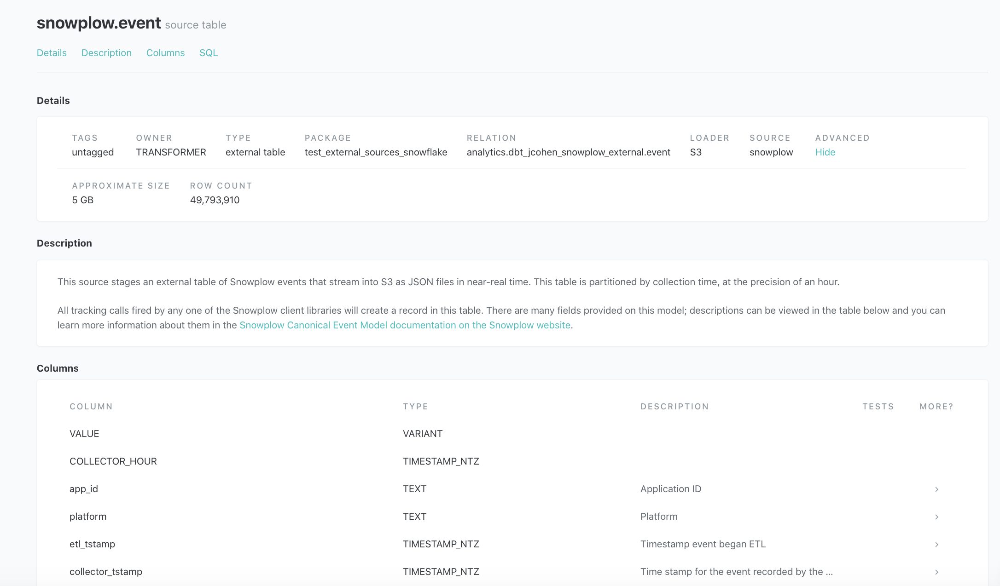

# External sources in dbt

dbt v0.15.0 [added support](https://github.com/dbt-labs/dbt/pull/1784) for an `external` property within `sources` that can include information about `location`, `partitions`, and other database-specific properties.

This package provides:
* Macros to create/replace external tables and refresh their partitions, using the metadata provided in your `.yml` file source definitions
* Snowflake-specific macros to create, backfill, and refresh snowpipes, using the same metadata

## Supported databases

* Redshift (Spectrum)
* Snowflake
* BigQuery
* Spark
* Synapse
* Azure SQL



## Installation

Follow the instructions at [hub.getdbt.com](https://hub.getdbt.com/dbt-labs/dbt_external_tables/latest/) on how to modify your `packages.yml` and run `dbt deps`.

## Syntax

The `stage_external_sources` macro is the primary point of entry when using this package. It has two operational modes: standard and "full refresh."

```bash
# iterate through all source nodes, create if missing, refresh metadata
$ dbt run-operation stage_external_sources

# iterate through all source nodes, create or replace (+ refresh if necessary)
$ dbt run-operation stage_external_sources --vars "ext_full_refresh: true"
```

The `stage_external_sources` macro accepts a limited node selection syntax similar to
[snapshotting source freshness](https://docs.getdbt.com/docs/running-a-dbt-project/command-line-interface/source/#specifying-sources-to-snapshot):

```bash
# stage all Snowplow and Logs external sources:
$ dbt run-operation stage_external_sources --args "select: snowplow logs"

# stage a particular external source table:
$ dbt run-operation stage_external_sources --args "select: snowplow.event"
```

## Setup

The macros assume that you:
1. Have already created your database's required scaffolding for external resources:
  - an external stage (Snowflake)
  - an external schema + S3 bucket (Redshift Spectrum)
  - an external data source and file format (Synapse)
  - an external data source and databse-scoped credential (Azure SQL)
  - a Google Cloud Storage bucket (BigQuery)
  - an accessible set of files (Spark)
2. Have the appropriate permissions on to create tables using that scaffolding
3. Have already created the database/project and/or schema/dataset in which dbt will create external tables (or snowpiped tables)

## Spec

```yml
version: 2

sources:
  - name: snowplow
    tables:
      - name: event
        description: >
            This source table is actually a set of files in external storage.
            The dbt-external-tables package provides handy macros for getting
            those files queryable, just in time for modeling.
                            
        external:
          location:         # required: S3 file path, GCS file path, Snowflake stage, Synapse data source
          
          ...               # database-specific properties of external table
          
          partitions:       # optional
            - name: collector_date
              data_type: date
              ...           # database-specific properties

        # Specify ALL column names + datatypes.
        # Column order must match for CSVs, column names must match for other formats.
        # Some databases support schema inference.

        columns:
          - name: app_id
            data_type: varchar(255)
            description: "Application ID"
          - name: platform
            data_type: varchar(255)
            description: "Platform"
          ...
```

The `stage_external_sources` macro will use this YAML config to compile and 
execute the appropriate `create`, `refresh`, and/or `drop` commands:

```
19:01:48 + 1 of 1 START external source spectrum.my_partitioned_tbl
19:01:48 + 1 of 1 (1) drop table if exists "db"."spectrum"."my_partitioned_tbl"
19:01:48 + 1 of 1 (1) DROP TABLE
19:01:48 + 1 of 1 (2) create external table "db"."spectrum"."my_partitioned_tbl"...
19:01:48 + 1 of 1 (2) CREATE EXTERNAL TABLE
19:01:48 + 1 of 1 (3) alter table "db"."spectrum"."my_partitioned_tbl"...
19:01:49 + 1 of 1 (3) ALTER EXTERNAL TABLE
```

## Resources

* [`sample_sources`](sample_sources): detailed example source specs, with annotations, for each database's implementation
* [`sample_analysis`](sample_analysis): a "dry run" version of the compiled DDL/DML that
`stage_external_sources` runs as an operation
* [`tested specs`](integration_tests/models/plugins): source spec variations that are confirmed to work on each database, via integration tests

If you encounter issues using this package or have questions, please check the [open issues](https://github.com/dbt-labs/dbt-external-tables/issues), as there's a chance it's a known limitation or work in progress. If not, you can:
- open a new issue to report a bug or suggest an enhancement
- post a technical question to [the Community Forum](https://discourse.getdbt.com/c/help/19)
- post a conceptual question to the relevant database channel (#db-redshift, #dbt-snowflake, etc) in the [dbt Slack community](https://community.getdbt.com/)

Additional contributions to this package are very welcome! Please create issues or open PRs against `master`. Check out [this post](https://discourse.getdbt.com/t/contributing-to-an-external-dbt-package/657) on the best workflow for contributing to a package.
